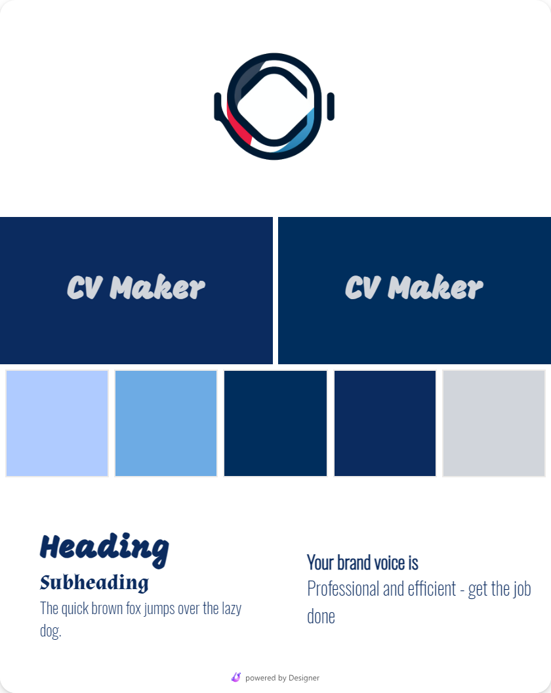

# CV-Application

This project I made while learning react.

## Description

This Project makes CV making process, a lot easier, just fill the details and you are ready to go. It currenrly has just 1 template, but I future I may add more templates.

## Making Process

1. Named it - CVee then CV Maker
2. Generated a Brand Kit from Microsoft Designer for my project to get some Colour Ideas.
   
3. Finally named it CV-Application
4. For designing UI, I took inspiration from some websites.
5. And made it.
6. Features like convert to PDF is not completed yet, but I will do it in some days.

### Installation

clone the repo
run `npm run dev`
thats it.

### Usage

Provide instructions on how to use your project. Include screenshots or examples if possible.

## Contributing

If you'd like to contribute, please follow these steps:

1. Fork the repository
2. Create a new branch (`git checkout -b feature/your-feature`)
3. Commit your changes (`git commit -am 'Add some feature'`)
4. Push to the branch (`git push origin feature/your-feature`)
5. Create a new Pull Request

## Contact

Harsh Raj @raj_harsh2001 (Twitter formaly X).
